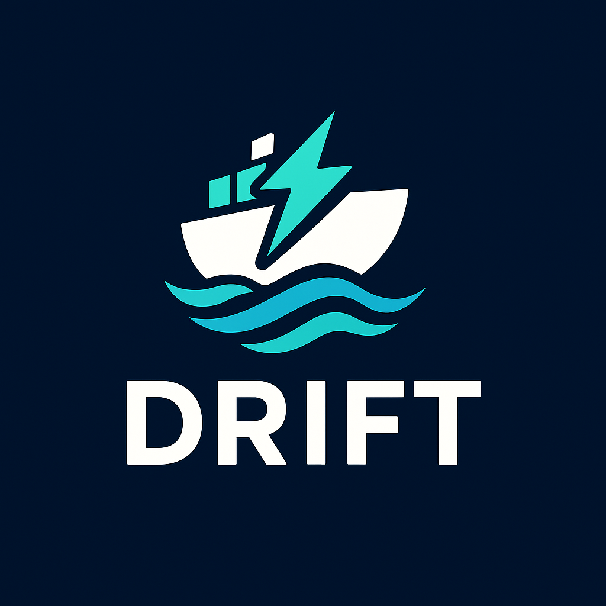

# Drift

<div align="center">



</div>

<div align="center">

**A modern, high‑performance OCI Registry + Web UI (for Bolt, Docker, Podman)**
*Rust-native • Secure • Fast • Developer-friendly*

[](https://www.rust-lang.org)
[](https://github.com/CK-Technology/drift/releases)
[](LICENSE)
[](https://github.com/CK-Technology/drift)

[](https://github.com/opencontainers/distribution-spec)
[](https://www.docker.com)
[](https://docs.docker.com/registry/spec/api/)
[](README.md#web-ui)
[](README.md#authentication--access)
[](README.md#storage-backends)
[](docker-compose.yml)

</div>

## 📑 Table of Contents

- [✨ Why Drift?](#-why-drift)
- [🚀 Quick Start](#-quick-start)
- [🧱 Architecture](#-architecture)
- [🔐 Authentication & Access](#-authentication--access)
- [🗄️ Storage Backends](#️-storage-backends)
- [🧰 Configuration](#-configuration-env-or-drifttoml)
- [📊 Monitoring & Ops](#-monitoring--ops)
- [🔀 Reverse Proxy](#-reverse-proxy-optional)
- [🔄 Compatibility Matrix](#-compatibility-matrix)
- [🎯 Features](#-features)
- [🗺️ Roadmap](#️-roadmap)
- [🧪 Development](#-development)
- [🔒 Security](#-security)
- [📄 License](#-license)
- [🙏 Credits](#-credits)

---

## ✨ Why Drift?

**Drift** is a sleek, self‑hosted **OCI image registry** with a **first‑class web console**—designed to be the perfect companion to **Bolt**, while remaining fully compatible with **Docker** and **Podman**. It focuses on:

* ⚡ **Performance**: Async Rust (Axum + Tokio), streaming layer, zero-copy paths where possible
* 🔐 **Security**: Immutable tags (optional), content-addressable storage, token & OIDC auth
* 🧩 **Compatibility**: Implements the **OCI Distribution Spec** & Docker Registry v2 APIs
* 🖥️ **Built‑in UI**: Browse repos, tags, layers; RBAC; audit logs; copy/paste pull/push
* 🗄️ **Flexible storage**: Local filesystem, S3/MinIO, or hybrid tiers
* 🛠️ **Ops‑friendly**: Prometheus metrics, structured logs, health/readiness probes

---

## 🚀 Quick Start

> **Prerequisites**: [Bolt](https://github.com/CK-Technology/bolt), Docker or Podman, ports `5000` (API) and `5001` (UI) available.

### 🔥 Bolt Integration

Drift is designed to work seamlessly with [Bolt](https://github.com/CK-Technology/bolt) - a next-generation container runtime. Visit the project for more details.

#### Boltfile Example 
# Advanced QUIC Networking Configuration
[quic_fabric]
enabled = true
node_id = "bolt-demo-node"
bind_address = "127.0.0.1"
bind_port = 4433
encryption = true
service_discovery = true

# Internal DNS Configuration
[dns_config]
enabled = true
port = 5353
domain = "demo.bolt.local"

[services.web]
image = "nginx:latest"
ports = ["80:80"]
# Service will be available at web.demo.bolt.local via Bolt DNS
# volumes = ["./site:/usr/share/nginx/html"]

[services.api]
capsule = "nodejs"
ports = ["3000:3000"] 
# Service will connect to db via encrypted QUIC
# env.DATABASE_URL = "quic://db.demo.bolt.local:5432"

[services.db]
capsule = "postgres"
ports = ["5432:5432"]
# Service will be auto-discovered via Bolt DNS
# encryption handled automatically by QUIC fabric

# [services.db.storage]
# size = "5Gi"

# [services.db.auth]
# user = "demo"
# password = "secret"


### Docker Compose

```yaml
version: "3.9"
services:
  drift:
    image: ghcr.io/ghoststack/drift:latest
    container_name: drift
    ports:
      - "5000:5000"   # OCI Registry API
      - "5001:5001"   # Web UI
    environment:
      # core
      - DRIFT_BIND_ADDR=0.0.0.0:5000
      - DRIFT_UI_ADDR=0.0.0.0:5001
      - DRIFT_STORAGE_BACKEND=fs
      - DRIFT_FS_ROOT=/var/lib/drift
      # auth (choose one)
      - DRIFT_AUTH=basic
      - DRIFT_USERS=admin:changeme,ci:tokenonly
      # alt: OIDC
      # - DRIFT_AUTH=oidc
      # - DRIFT_OIDC_ISSUER=https://auth.example.com/realms/main
      # - DRIFT_OIDC_CLIENT_ID=drift
      # - DRIFT_OIDC_CLIENT_SECRET=***
      # tls (optional if reverse‑proxied)
      # - DRIFT_TLS_CERT=/certs/fullchain.pem
      # - DRIFT_TLS_KEY=/certs/privkey.pem
    volumes:
      - ./data:/var/lib/drift
      # - ./certs:/certs:ro
```

Then:

```bash
docker compose up -d
# API: http://localhost:5000/v2/
# UI : http://localhost:5001/
```

### Pushing & Pulling

```bash
# Docker/Podman
docker login localhost:5000 -u admin -p changeme

docker tag alpine:3 localhost:5000/core/alpine:3
docker push localhost:5000/core/alpine:3

docker pull localhost:5000/core/alpine:3
```

### With Bolt (example)

```bash
bolt push localhost:5000/ghost/demo:latest
bolt pull localhost:5000/ghost/demo:latest
```

---

## 🧱 Architecture

```
drift/
├─ src/
│  ├─ api/             # OCI Distribution Spec + auth middleware
│  │  ├─ registry/     # Registry endpoints (manifests, blobs, uploads)
│  │  ├─ auth.rs       # Authentication handlers
│  │  ├─ bolt.rs       # Bolt integration endpoints
│  │  └─ middleware.rs # Request middleware
│  ├─ auth/            # Authentication & authorization
│  │  ├─ jwt.rs        # JWT token handling
│  │  └─ oauth.rs      # OAuth2/OIDC providers
│  ├─ storage/         # Storage backends
│  │  ├─ filesystem.rs # Local filesystem storage
│  │  ├─ s3.rs         # S3/MinIO storage
│  │  └─ ghostbay.rs   # GhostBay integration
│  ├─ ui/              # Web console (Leptos + Axum)
│  │  ├─ components/   # Reusable UI components
│  │  └─ pages/        # Application pages
│  ├─ config.rs        # Configuration management
│  ├─ server.rs        # HTTP server setup
│  └─ main.rs          # Application entry point
├─ assets/             # Static assets and icons
├─ scripts/            # Development and deployment scripts
├─ docker-compose.yml  # Container orchestration
├─ Dockerfile          # Container image definition
└─ drift.toml          # Default configuration
```

* **API**: Axum handlers implementing `v2/` routes (manifests, blobs, tags)
* **Auth**: Basic, **Bearer tokens**, or **OIDC** (Keycloak/Auth0/GitHub OIDC)
* **Storage**: Pluggable trait with drivers for **filesystem** & **S3/MinIO**
* **UI**: Browse orgs/repos/tags, inspect manifest & layers, copy pull/push cmd
* **Ops**: `/healthz`, `/readyz`, `/metrics` (Prometheus), JSON logs

---

## 🔐 Authentication & Access

**Modes**

* `basic`: simple user\:pass (development, small teams)
* `token`: external token issuer (CI/CD integration)
* `oidc`: OpenID Connect login (SSO)

**Scopes** (token/oidc)

* `repository:repoName:pull`
* `repository:repoName:push`
* `registry:catalog:*`

Example: CI job gets `repository:ghost/demo:push` only.

---

## 🗄️ Storage Backends

### Filesystem

```env
DRIFT_STORAGE_BACKEND=fs
DRIFT_FS_ROOT=/var/lib/drift
```

### S3/MinIO

```env
DRIFT_STORAGE_BACKEND=s3
DRIFT_S3_BUCKET=drift-registry
DRIFT_S3_ENDPOINT=https://s3.example.com
DRIFT_S3_REGION=us-east-1
DRIFT_S3_ACCESS_KEY=...
DRIFT_S3_SECRET_KEY=...
DRIFT_S3_PATH_STYLE=true
```

> Buckets should be versioned for safety. Drift stores content by digest (CAS).

---

## 🧰 Configuration (env or `drift.toml`)

```toml
[server]
bind_addr = "0.0.0.0:5000"
ui_addr   = "0.0.0.0:5001"

[auth]
mode = "oidc" # "basic" | "token" | "oidc"
[basic]
users = ["admin:changeme", "ci:tokenonly"]

[oidc]
issuer = "https://auth.example.com/realms/main"
client_id = "drift"
client_secret = "***"

[storage]
backend = "fs" # "fs" | "s3"
fs_root = "/var/lib/drift"

[s3]
endpoint = "https://s3.example.com"
region   = "us-east-1"
bucket   = "drift-registry"
path_style = true
access_key = "..."
secret_key = "..."

[retention]
# optional tag immutability & GC windows
immutable_tags = ["release", "prod"]
min_age_days = 7
```

---

## 📊 Monitoring & Ops

* **Health**: `GET /healthz`, `GET /readyz`
* **Metrics**: `GET /metrics` (Prometheus)
* **Tracing**: `RUST_LOG=info` (or `debug/trace`) with JSON logs
* **Garbage Collection** (planned): offline & online mark/sweep for unreferenced blobs

---

## 🔀 Reverse Proxy (optional)

Place Drift behind NGINX/Traefik/Caddy or **Wraith**:

```nginx
server {
  listen 443 ssl http2;
  server_name registry.example.com;

  ssl_certificate     /etc/letsencrypt/live/registry/fullchain.pem;
  ssl_certificate_key /etc/letsencrypt/live/registry/privkey.pem;

  location /v2/ {
    proxy_pass http://drift:5000;
    proxy_set_header Host $host;
    proxy_set_header X-Forwarded-Proto $scheme;
  }

  location / {
    proxy_pass http://drift:5001; # UI
  }
}
```

---

## 🔄 Compatibility Matrix

| Feature               | Drift | Docker Registry v2  | Harbor |
| --------------------- | ----- | ------------------- | ------ |
| OCI Distribution Spec | ✅     | ✅                   | ✅      |
| Token/OIDC auth       | ✅     | 🔶 (plugins)        | ✅      |
| Web UI built-in       | ✅     | ❌                   | ✅      |
| S3/MinIO storage      | ✅     | ✅                   | ✅      |
| Immutability          | ✅     | 🔶 (via middleware) | ✅      |
| GC                    | 🚧    | ✅                   | ✅      |

> 🔶 Possible via external middleware or custom builds.

---

## 🎯 Features

### ✅ Current Features
- **OCI Distribution Spec** compliance (Docker Registry v2 API)
- **Multi-backend storage** (filesystem, S3, MinIO, GhostBay)
- **Authentication** (Basic, Bearer tokens, OIDC/OAuth2)
- **Web UI** with repository browsing and management
- **Bolt integration** for next-gen container workloads
- **Prometheus metrics** and structured logging
- **TLS/HTTPS support** with configurable certificates
- **Docker Compose** ready deployment

### 🚧 In Development
- **Garbage collection** (online/offline cleanup)
- **Enhanced RBAC** (organization and team permissions)
- **Content signing** (Cosign/Notary v2 integration)

## 🗺️ Roadmap

### v0.2.0 (Next Release)
* [ ] **GC**: Online/Offline garbage collection
* [ ] **Enhanced UI**: Tag management, layer inspection
* [ ] **Audit logging**: Comprehensive action tracking
* [ ] **Performance**: Streaming uploads/downloads optimization

### v0.3.0 (Future)
* [ ] **Content signing**: Cosign/Notary v2 metadata surfacing
* [ ] **Org/Team RBAC**: Fine‑grained permissions management
* [ ] **Replication**: Mirror/pull-through cache, multi‑region
* [ ] **Quotas**: Per org/repo storage & rate limits

### v1.0.0 (Long-term)
* [ ] **CLI**: `driftctl` for admin operations & migrations
* [ ] **Plugin system**: Extensible storage and auth backends
* [ ] **High availability**: Multi-node clustering support

---

## 🧪 Development

### Building from Source

```bash
# Clone the repository
git clone https://github.com/CK-Technology/drift.git
cd drift

# Build the project
cargo build --release

# Run in development mode
RUST_LOG=debug cargo run --bin drift

# Run tests
cargo test --workspace

# Lint and format
cargo fmt && cargo clippy --all-targets -- -D warnings
```

### Development Setup

```bash
# Install development dependencies
./scripts/setup-dev.sh

# Start development environment
docker-compose -f docker-compose.yml up -d
```

---

## 🔒 Security

* **Content-addressable storage** (CAS) - all content identified by cryptographic digest
* **Optional tag immutability** & signed manifest enforcement (roadmap)
* **Private by default** - anonymous access disabled unless explicitly enabled
* **Regular security audits** via `cargo audit` & dependency scanning
* **TLS/HTTPS support** with configurable certificates
* **Token-based authentication** with configurable expiration
* **Role-based access control** (RBAC) for fine-grained permissions

---

## 📄 License

MIT © [CK Technology](https://github.com/CK-Technology)

---

## 🙏 Credits

Inspired by the OCI community and prior art (Docker Registry, Harbor, Zot). Built to pair beautifully with **[Bolt](https://github.com/CK-Technology/bolt)** while staying open and compatible with every container tool you already use.

**Special thanks to**:
- The [OCI](https://opencontainers.org/) community for standardization efforts
- [Docker Registry](https://github.com/distribution/distribution) for pioneering container registries
- [Harbor](https://goharbor.io/) for enterprise registry features
- [Rust](https://www.rust-lang.org/) ecosystem for reliable, performant tooling

